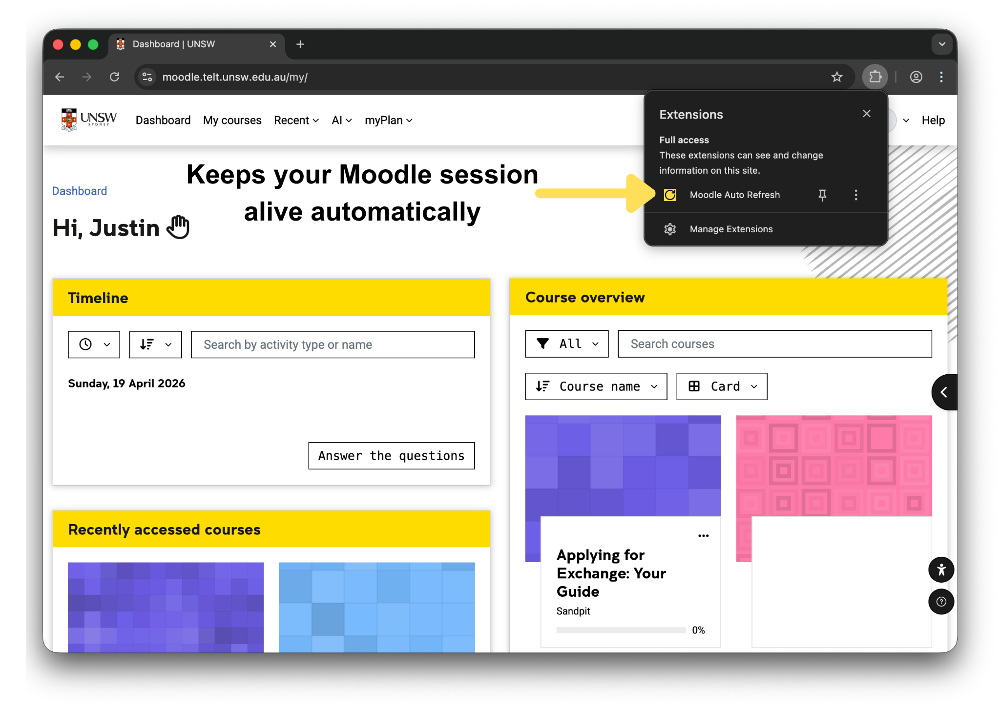
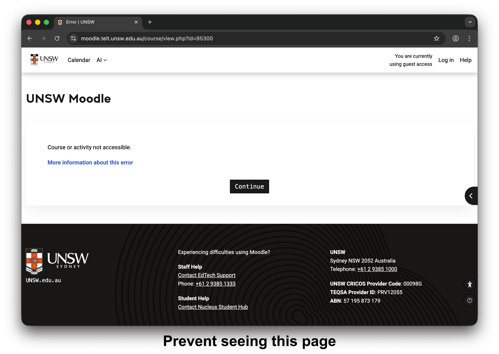

# Moodle Auto Refresh
A browser extension that automatically keeps your Moodle session alive to prevent being signed out. Built for UNSW Moodle (moodle.telt.unsw.edu.au).

Works on both Firefox and Chrome.

<table>
    <tr>
        <td width="50%">
            
        </td>
        <td width="50%">
            
        </td>
    </tr>
</table>

## Features
- Keeps your Moodle session active using Moodle's built-in session keepalive request
- Runs periodically in the background using the alarms API
- Does not reload Moodle pages during normal operation
- Lightweight and simple, with no setup required

## Installation
Moodle Auto Refresh can be installed at:

- Firefox: https://addons.mozilla.org/en-US/firefox/addon/moodle-auto-refresh/
- Chrome: https://chromewebstore.google.com/detail/moodle-auto-refresh/kjllfjjomalnniconkbanfbpaccllphk

## Privacy
This extension does not collect, store, or transmit any user data. This extension also does not modify page content, read course material, submit forms or inject third-party scripts. Session keepalive requests are sent directly to UNSW Moodle.